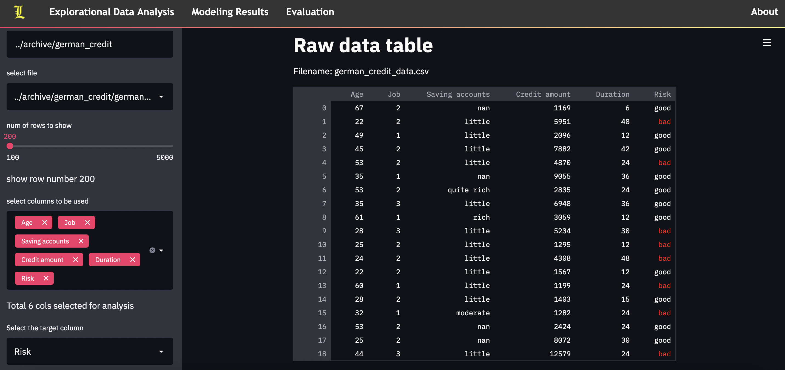

# Streamlit AutoModel with XGBoost (demo)



## Requirements

```python
streamlit==0.85.1
```

## Usage

cd into streamlit_navbar dir, and use the following commands to run the platform

```shell
streamlit run navigation.py  # call the streamlit functions based on urls
python application.py   # start flask service
```

## Reference

navigation bar implementation is mainly based on [streamlit_navbar](https://github.com/BugzTheBunny/streamlit_navbar)

